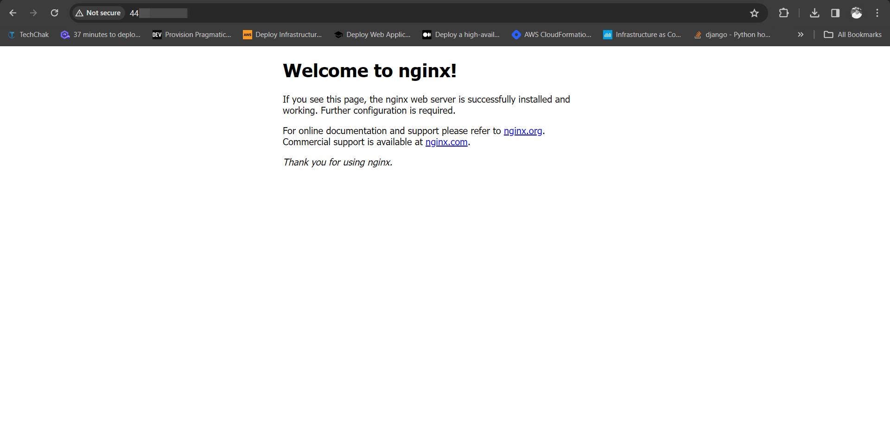
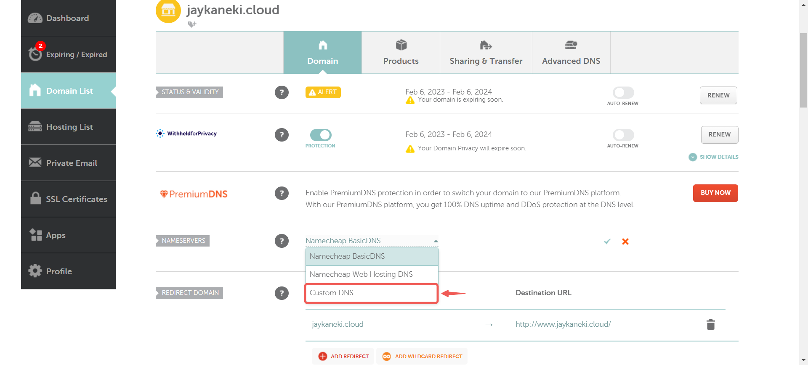

# Project1: Creating A Static Website Using Nginx

## Creating an ubuntu server
- I selected the Ec2 option in my aws management console and selected launch instance
- I named my instance **Project1**and selected the **ubuntu** ami.png)
-I clicked on the **Create new key pair** button and named my key pair **cube** 
- create the key pair .png)
-Enable SSH, HTTP, and HTTPS access, then proceed to click Launch instance.
- click on view all instances to view your instance
click on the created instance and click on the connect buttin
- copy the command under the ssh client
- open a terminal where your .pem file was stored paste the previously copied command and press enter
.png)

## creating and assigning an elastic IP
- Go back to your AWS and select EC2 again if you ve closed it already, if not on the menu bar select **Elastic IPs** under network & security
.png)
- click on the **Allocate Elastic UP address** button
- keep the setting unchanged and select allocate
- the prompt will appear on top, click on the button 

- select the instance you want to associate it with
> [!NOTE]
> The IP address for your instance has been updated to the elastic IP associated with it. Therefore, you will need to SSH into your instance again. Return to the connection page of your instance and copy the new command.
- go back to your terminal and paste the command. when prompted, type **yes** and the press enter

## INSTALL NGINX AND SETUP YOUR WEBSITE
- Execute the following commands on your terminal
```
sudo apt update
sudo apt upgrade
sudo apt install nginx
```
- start your Nginx server with the command
`sudo systemctl start nginx`
to start on boot execute
`sudo systemctl enable nginx`
confirm if it is running by executing
`sudo systemctl status nginx`
- Go back to your EC2 dashboard and copy your **Public IPv4 address** and search it up in a browser to view your nginx startup page

- find a website template from any website of your choice
- on that tab right click and select inspect, navigating to the network option
- download the template and you will see the website zip folder appear. place your pointer on it and right click

> [!caution] 
> Make sure you right-click on the zip folder, the one that says .zip. If it doesn't appear after clicking download, try clicking the download button again until it shows up, as shown in the picture.
- hover your cursor over _copy_ and then click on **copy url** from the list that appears on the right.
- Paste the URL into a notebook to use alongside the **`curl`** command when downloading the website content to your machine.


---

- Run this command **`sudo curl -o /var/www/html/2137_barista_cafe.zip https://www.tooplate.com/zip-templates/2137_barista_cafe.zip`** to download the websites file to your html directory.


> [!NOTE]
The **`curl`** command is a utility for making HTTP requests via the command line. Here, it's utilized to retrieve a file from a specified URL.
The **`-o`** flag designates the output file or destination. In this instance, it signifies that the downloaded file, named **"2137_barista_cafe.zip"**, should be stored in the **"/var/www/html/"** directory.
The URL **`https://www.tooplate.com/zip-templates/2137_barista_cafe.zip`** is the source for downloading the file. Make sure to replace it with the URL of your own website template. Curl will retrieve the content located at this URL.

- To install the unzip tool, run the following command: **`sudo apt install unzip`**.

- Navigate to the web server directory by running the following command: **`cd /var/www/html`**.


- Unzip the contents of your website by running **`sudo unzip <website template name>`**.

> [!NOTE]
Replace **`<website template name>`** with the actual name of your website zip file. For example, mine is **2137_barista_cafe.zip** so i ran **`sudo unzip 2137_barista_cafe.zip`**.

- Update your nginx configuration by running the command **`sudo nano /etc/nginx/sites-available/default`**. Then, edit the **`root`** directive within your server block to point to the directory where your downloaded website content is stored.


- Restart Nginx to apply the changes by running: **`sudo systemctl restart nginx`**.

- Open a web browser and go to your **Public IPv4 address/Elastic IP address** to confirm that your website is working as expected.

.png)

---

### Create An A Record

To make your website accessible via your domain name rather than the IP address, you'll need to set up a DNS record. I did this by buying my domain from Namecheap and then moving hosting to AWS Route 53, where I set up an A record.

> [!NOTE]
Your domain registrar's interface might look different, but they all follow a similar basic layout.

- On the website click on **Domain List** and Click on the **Manage** button.

- Go back to your AWS console, search for **Route 53①**, and then choose **Route 53②** from the list of services shown.


- Click on **Get started**.

- Select **Create hosted zones①** and click on **Get started②**.

- Enter your **Domain name①**, choose **Public hosted zone②** and then click on **Create hosted zone③**.


- Select the **created hosted zone①** and copy the assigned **Values②**.


- Go back to your domain registrar and select **Custom DNS** within the **NAMESERVERS** section.



- Paste the values you copied from Route 53 into the appropriate fields, then click the **checkmark symbol** to save the changes.

- Head back to your AWS console and click on **Create record**.


- Paste your Elastic IP address and then click on **Create records**.

- Your A record has been successfully created.

.png)

- Click on **create record** again, to create the record for your sub domain.

- Input the Record name(**www➀**), paste your **IP address➁**, and then click on **Create records➂**.


> [!NOTE]
Make sure to create DNS records for both your root domain and subdomain. This involves setting up an A record for the root domain (e.g., **`example.com`**) and another A record for the subdomain (e.g., **`www.example.com`**). These records will direct traffic to your server's IP address, ensuring that both your main site and any subdomains are accessible.

- Open your terminal and run **`sudo nano /etc/nginx/sites-available/default`** to edit your settings. Enter your domain and subdomain names, then save the changes.


- Restart your nginx server by running the **`sudo systemctl restart nginx`** command.

- Go to your domain name in a web browser to verify that your website is accessible.


> [!NOTE]
You may notice the sign that says **Not secure**. Next, you'll use certbot to obtain the SSL certificate necessary to enable HTTPS on your site.

---

### Install certbot and Request For an SSL/TLS Certificate

- Install certbot by executing the following commands:
**`sudo apt update`**
**`sudo apt install certbot python3-certbot-nginx`**


- Execute the **`sudo certbot --nginx`** command to request your certificate. Follow the instructions provided by certbot and select the domain name for which you would like to activate HTTPS.


- Verify the website's SSL using the OpenSSL utility with the command: **`openssl s_client -connect damitech.com.ng:443`**

- Visit **`https://<domain name>`** to view your website.

.png)


