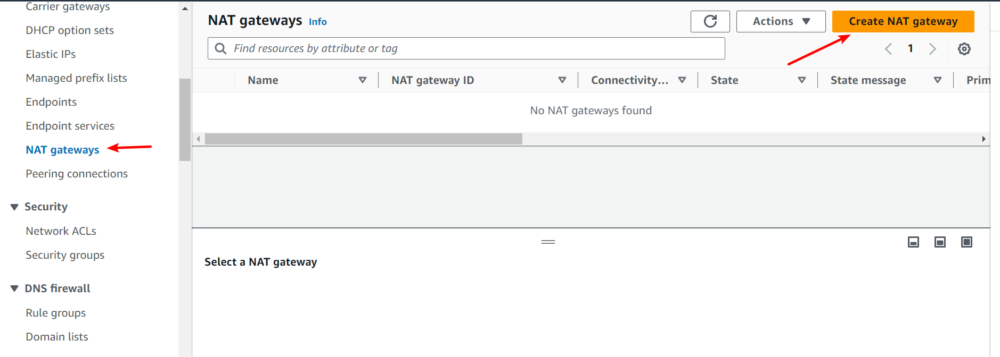

# Project 7: AWS VPC Project
## STEP 1

Let's create a VPC for our project and assign attach an internet gateway to it

- In your aws console search up vpc and access it
- click on create vpc
- set the fields as seen in the following pictures
.png)

- Now we create an Internet Gateway
.png)

- select the internet gateway option
.png)

- click on create internet gateway and fill according to the image
.png)

- click on create
- Click on actions and select attatch to vpc
.png)

- attach to the created internet gateway
.png)

- Go to the subnets section and create the subnets as provided below

- Public Subnets

| Subnet Name          | Availability Zone | CIDR Block  | Type   |
|----------------------|-------------------|-------------|--------|
| Prod-Web-Public-2a   | us-west-2a        | 10.0.0.0/28  | Public |
| Prod-Web-Public-2b   | us-west-2b        | 10.0.0.16/28 | Public |
| Prod-Web-Public-2c   | us-west-2c        | 10.0.0.32/28 | Public |

- Application Subnets

| Subnet Name          | Availability Zone | CIDR Block  | Type    |
|----------------------|-------------------|-------------|---------|
| Prod-App-Private-2a  | us-west-2a        | 10.0.0.48/28 | Private |
| Prod-App-Private-2b  | us-west-2b        | 10.0.0.64/28 | Private |
| Prod-App-Private-2c  | us-west-2c        | 10.0.0.80/28 | Private |

- Database Subnets

| Subnet Name         | Availability Zone | CIDR Block  | Type    |
|---------------------|-------------------|-------------|---------|
| Prod-DB-Private-2a  | us-west-2a        | 10.0.0.96/28 | Private |
| Prod-DB-Private-2b  | us-west-2b        | 10.0.0.112/28 | Private |
| Prod-DB-Private-2c  | us-west-2c        | 10.0.0.128/28 | Private |

- Management Subnets

| Subnet Name           | Availability Zone | CIDR Block   | Type    |
|-----------------------|-------------------|--------------|---------|
| Prod-Mgmt-Private-2a  | us-west-2a        | 10.0.0.144/28 | Private |
| Prod-Mgmt-Private-2b  | us-west-2b        | 10.0.0.160/28 | Private |
| Prod-Mgmt-Private-2c  | us-west-2c        | 10.0.0.176/28 | Private |

- Platform Subnets

| Subnet Name              | Availability Zone | CIDR Block   | Type    |
|--------------------------|-------------------|--------------|---------|
| Prod-Platform-Private-2a | us-west-2a        | 10.0.0.192/28 | Private |
| Prod-Platform-Private-2b | us-west-2b        | 10.0.0.208/28 | Private |
| Prod-Platform-Private-2c | us-west-2c        | 10.0.0.224/28 | Private |

###  This is how it should look like after you create all the subnets
.png)

## Route Table Design
For each subnet group, we will create a custom route table and assign rules required for the specific subnets.
- Now go to the route table opyion and click on it
- click on create route table
- Name the first route table like this and select the vpc you created
.png)

- click on create
- we will now edit the subnet association
.png)

- Select all the subnet bearing the public word
.png)

- Repeat the same thing for all others by creating a route table for each eg. Mgmt-rt, prod-rt etc and make sure to associate the related subnet to it.
### When you completly create all 5 it would look like this:
.png)

## NAT Gateway

A NAT gateway is a Network Address Translation (NAT) service. You can use a NAT gateway so that instances in a private subnet can connect to services outside your VPC but external services cannot initiate a connection with those instances.

We need to create a NAT gateway and attach it to all our route tables created earlier

- select the NAT gateway option and click on create 

- fill in the fields and select the vpc to use

###  Now we will add the NAT gateway to our route tables one by one except for the public.rt:

.png)

.png)

.png)

If you noticed we did not do anything to our public subnet we want to route traffic uing a service called internet gateway so let's attach it to the  public route table

- For the public.rt we will be using the internet gateway we created earlier
.png)
# AWS VPC Topology
The following diagram shows the high-level VPC topology for our design.

Note: Both the internet Gateway (IGW) and NAT gateway(NAT-GW) gets deployed in the public subnet.

To check our VPC topology:
.png)

# Network ACLs

# DB NACL (Inbound Rules)

| Rule Number | Type       | Protocol | Port Range | Source IP   | Allow/Deny |
|-------------|------------|----------|------------|-------------|------------|
| 100         | Custom TCP | TCP      | 3306       | 10.0.0.96/28 | Allow     |
| 110         | Custom TCP | TCP      | 3306       | 10.0.0.112/28 | Allow    |
| 120         | Custom TCP | TCP      | 3306       | 10.0.0.128/28 | Allow    |
| *           | All Traffic| All      | All        | 0.0.0.0/0   | Deny       |

# DB NACL (Outbound Rules)

| Rule Number | Type       | Protocol | Port Range | Destination IP | Allow/Deny |
|-------------|------------|----------|------------|----------------|------------|
| 100         | Custom TCP | TCP      | 3306       | 10.0.0.192/28    | Allow    |
| 110         | Custom TCP | TCP      | 3306       | 10.0.0.208/28    | Allow    |
| 120         | Custom TCP | TCP      | 3306       | 10.0.0.224/28    | Allow    |
| *           | All Traffic| All      | All        | 0.0.0.0/0        | Deny     |

 The above table serves as a guide to how your implemetation would look like:
 
 .png)
 .png)
 .png)

 ## REFER TO THE PROJECT BREAKDOWN FOR FURTHER EXPLANATION

 END OF PROJECT 7